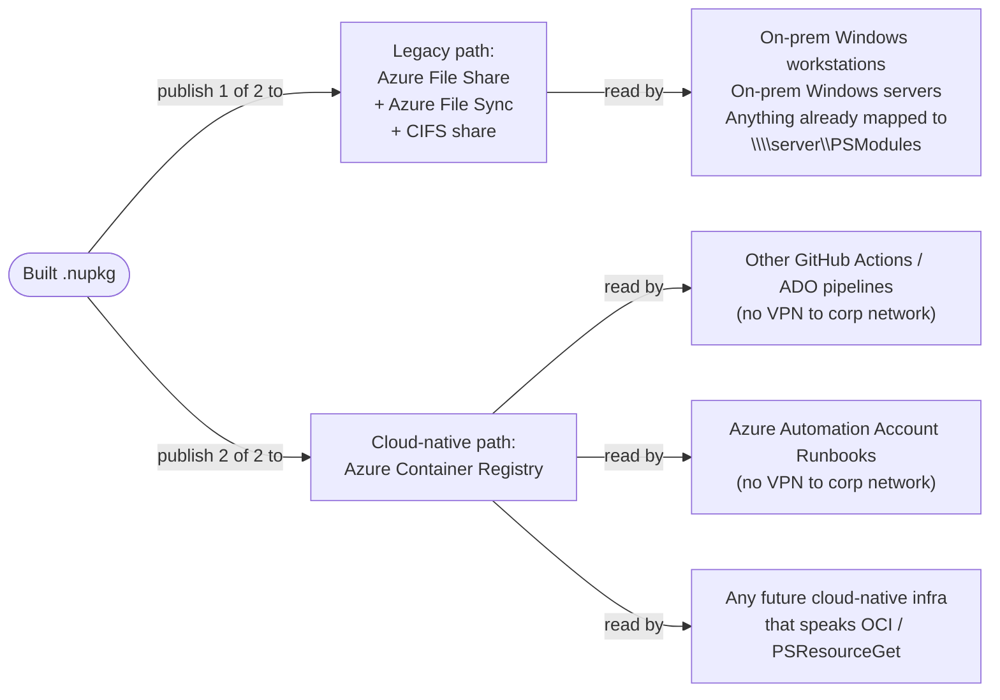

Concept proven:  `*.nuget` files that I upload through `az storage file upload-batch` and give a little push with `az storagesync sync-group cloud-endpoint trigger-change-detection` do, indeed, end up not only on the synced server's filesystem as `.nuget` files, but also show up as modules via `Register-PSRepository` against that file path and with `Find-Module`.

Which doesn't sound very fancy, until you think about the fact that that server's disk drive can end up becoming a CIFS / SMB Windows File Share "network drive" for an entire enterprise, if necessary.

In other words, a publicly networked generic CI/CD pipeline like a GitHub Action could be responsible for turning `.psd` files and such into `.nuget` files via `Build-Module`, and then could "publish" them into an enterprise legacy CIFS fileshare via `az storage file upload-batch` + `az storagesync sync-group cloud-endpoint trigger-change-detection` instead of the CI/CD pipeline worrying about trying to `Publish-PSResource` or `Publish-Module` directly into the fileserver.

---

_(It could still also `Publish-PSResource` into Azure Container Registry, though, as a treat.  Doing a dual-publish after build -- one into a next-gen registry and another into a legacy registry -- could help ensure that both older systems and newer systems can find a usable registry **somewhere**.  Other public cloud infrastructure resources like other CI/CD pipelines or like Azure Automation Account Runbooks would probably do better trying to run `Register-PSRepository` or `RegisterPSResourceRepository` against a newer-style PowerShell gallery hosted on publicly networked cloud-native infrasturcture, though, since they too would probably encounter the same network/technology/etc. line-of-sight issue against a CIFS fileshare that publication into CIFS fileshare presented.)_

---

* Note to future self:  One of my favorite parts of this codebase is in my Terraform resource definition for a `foreach`-typed [`azurerm_storage_sync_server_endpoint` named `my_ssseps`](.prereqs/AA-tf/modules/cloud_storage_and_share/main.tf).
    * Haven't run `Register-AzStorageSyncServer -ResourceGroupName 'rg_goes_here' -StorageSyncServiceName 'sss_goes_here` from your VM just yet?
        * No problem; Terraform will just pick up that there are 0 "registered servers" attached to the Storage Sync Service and provision 0 Storage Sync Server Endpoints.
    * Finally got around to running `Register-AzStorageSyncServer`?
        * Great; just run the Terraform again _(kind of like you probably already re-run the same Terraform over and over again as drift remediation)_, and Terraform will pick up that there are now X "registered servers" and make sure that there are also X "server endpoints" to go with them.
        * If you've got a split between the people allowed to provision your cloud infrastructure and the sysamins allowed to configure your legacy CIFS servers by running `Register-AzStorageSyncServer` from them, you can still leave all of the Azure work to the Azure team.
            * Doing so helps ensure that you can follow the infosec **principle of least privilege**, rather than granting CIFS server sysadmins who don't usually work in Azure privileges to create the "server endpoint" in Azure.
            * Yes, your Azure team will have to do a "round two" once the CIFS sysadmin tells them they're done, but they just have to run `terraform apply` afresh, not reauthor and retest the Terraform code.
            * Well, that or the Azure team can put it on a nightly drift-remediation cycle and just tell the CIFS sysadmins to wait 24 hours, if they want to be cheeky.
